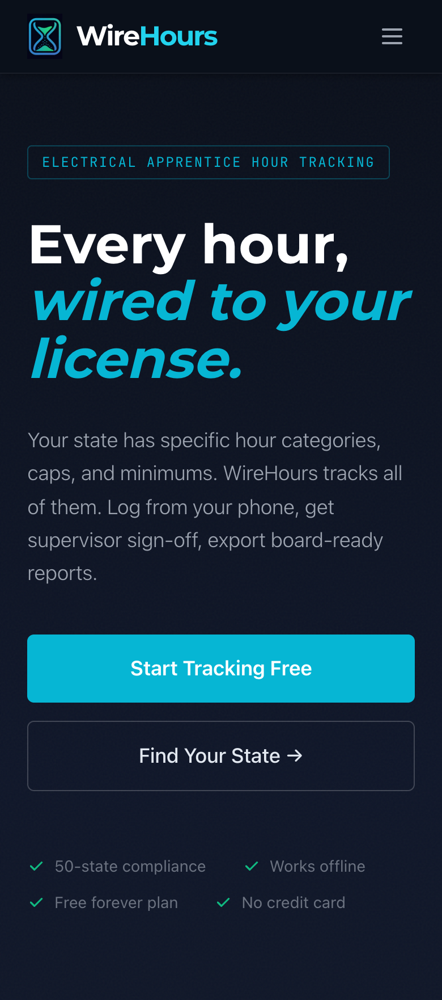
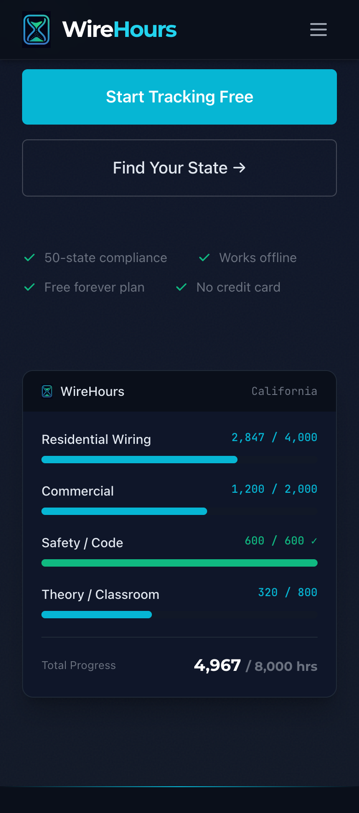
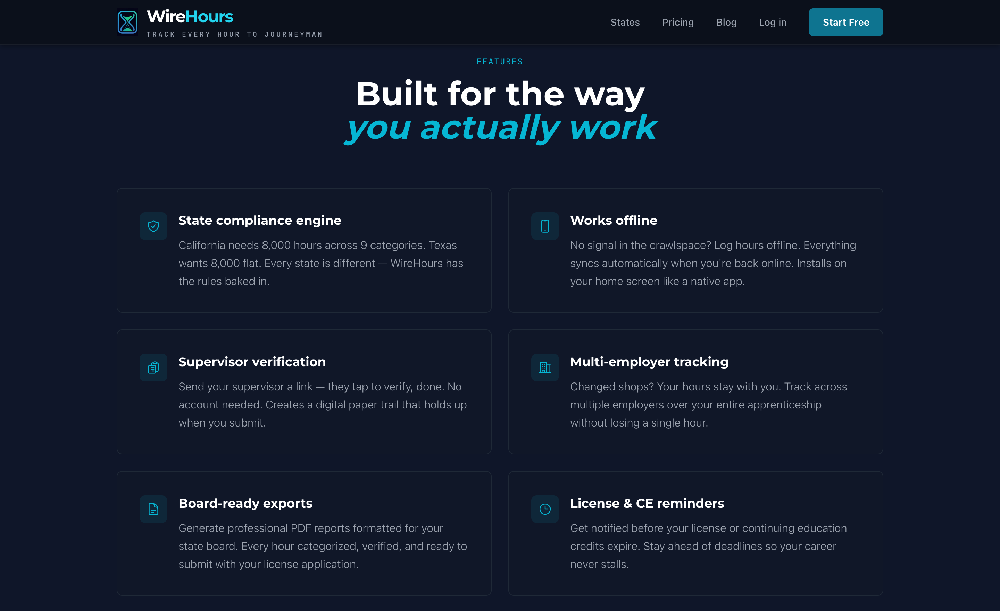
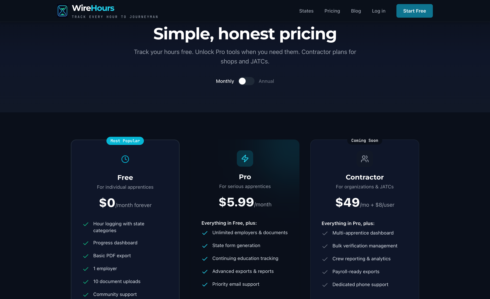
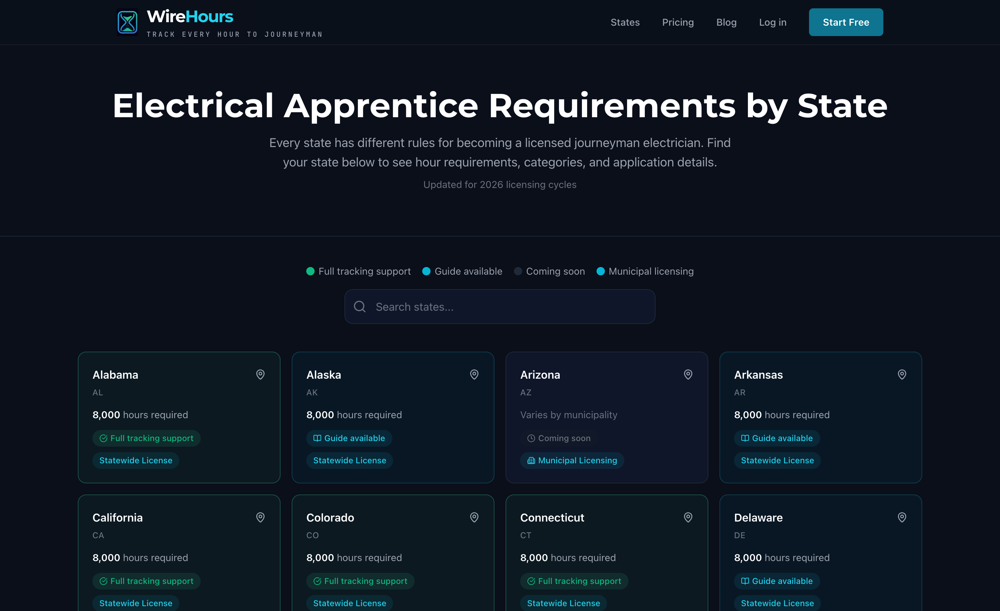
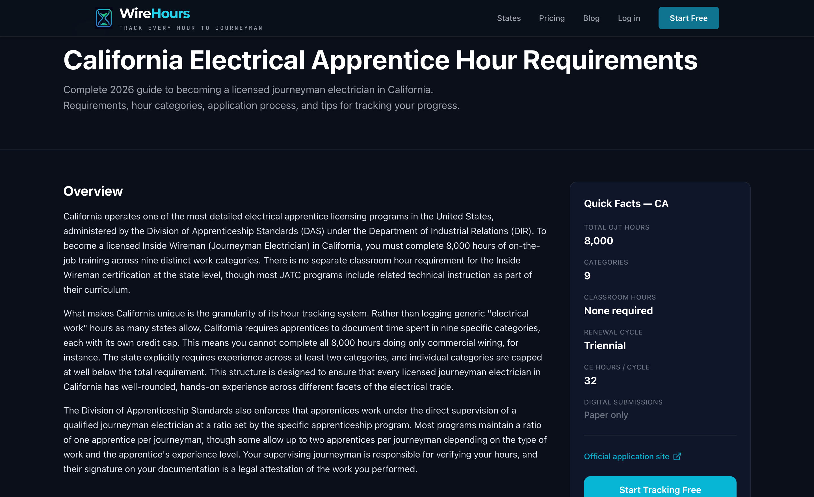

# WireHours — Compliance Hour Tracking for Electrical Apprentices

> A mobile-first web application that helps electrical apprentices track, verify, and document their on-the-job hours toward journeyman licensing — replacing scattered notebooks, pay stubs, and spreadsheets with a purpose-built digital system.

**Live product** · **Freemium SaaS** · **Solo founder build**

---

## The Problem

Electrical apprentices across the U.S. must document **thousands of hours** across state-specific categories before qualifying for a journeyman license. Most track these hours using notebooks, pay stubs, and memory — a process that leads to lost documentation, employer disputes, and delayed licensing.

Through extensive voice-of-customer research across trade forums, I identified six recurring pain points:

| Pain Point | Real Impact |
|---|---|
| **Employers won't sign off** | Apprentices lose years of undocumented work when employers refuse to verify hours |
| **No purpose-built system** | Hours tracked across 3+ disconnected tools (notebooks, pay stubs, spreadsheets) |
| **Changing employers = hours at risk** | Documentation gaps when switching jobs; records don't follow the worker |
| **State requirements are confusing** | Category requirements, caps, and forms vary dramatically by state |
| **Supervisor verification is painful** | Chasing signatures months or years after the work was done |
| **Proving hours after the fact** | Desperation when applying for licensure with inadequate records |

The common advice on every trade forum: *"Track your own hours. Don't depend on anyone else to do it."* Yet no tool existed to make that easy.

---

## The Solution

WireHours is a progressive web app designed for apprentices in the field — quick hour logging from a phone, state-aware category tracking, digital supervisor verification, and automated state board form generation.

### Landing Page


### Mobile Experience

<p align="center">
  
  
</p>

### Key Features

- **Quick Log** — Log hours in under 30 seconds with date, category, hours, and optional location stamp
- **State-Specific Categories** — Automatically shows the correct hour categories and caps for the apprentice's state (CA, WA, TX, MA at launch, expanding)
- **Supervisor Verification** — Digital sign-off workflow via SMS/email; supervisors verify hours without needing an account
- **Progress Dashboard** — Real-time visualization of hours by category against state requirements
- **State Board Form Export** — Generate pre-filled forms matching each state's specific documentation requirements
- **Employer History** — Hours follow the apprentice across jobs with timestamped, verified records
- **Offline Capable** — Service worker caching enables hour logging on job sites without reliable connectivity

### Features Overview



### Business Model

| Tier | Price | Features |
|---|---|---|
| **Free** | $0 | Basic hour logging, limited exports |
| **Pro** | $5.99/mo | State-specific categories, form generation, unlimited exports, CE tracking |
| **Contractor** | $49/mo + $8/user | Team dashboard, multi-apprentice management, bulk verification |

### Pricing Page



---

## My Role

**Solo founder** — Product strategy, market research, UX design, full-stack development, go-to-market execution, and community engagement.

---

## Market Context

- **~200,000** active electrical apprentices across the U.S.
- **Zero** purpose-built digital tools for compliance hour tracking (existing solutions are generic time trackers or clunky government portals)
- **Strong word-of-mouth dynamics** — apprentices actively discuss hour tracking challenges in tight-knit trade communities
- **High switching cost** — once an apprentice starts logging hours in a system, they're unlikely to move
- Initial focus on states with clear statewide licensing requirements: **California, Washington, Texas, Massachusetts**

### State Compliance Coverage





---

## Technical Architecture

### Stack

| Layer | Technology | Rationale |
|---|---|---|
| **Frontend** | Next.js 14 (App Router) | SSR for SEO content pages, app router for the logged-in experience |
| **PWA** | Service Workers + Web Manifest | Universal device access, offline support, home screen install — no app store dependency |
| **Database** | Supabase (Postgres) | Row-level security for multi-tenant data isolation, real-time subscriptions |
| **Auth** | Supabase Auth | Email/password + Google OAuth, handles the supervisor verification token flow |
| **Payments** | Stripe | Subscription billing with webhook-driven tier management |
| **Email** | Resend | Transactional emails (verification requests, progress reminders, license expiration alerts) |
| **SMS** | Twilio | Supervisor sign-off invitations via text — critical for reaching tradespeople |
| **Hosting** | Vercel | Edge deployment, zero-config Next.js integration |
| **Analytics** | Privacy-friendly (no cookie banner) | Important for trade audience trust |

### Why PWA Over Native

This was the highest-leverage architectural decision. Trade workers skew heavily toward Android (~60% of the workforce), and a PWA provides:

- **Universal access** — any modern browser, any device
- **No app store gatekeeping** — instant updates, no review delays
- **Install to home screen** — feels native without the native overhead
- **Offline-first** — service workers cache the app shell and queue hour entries for sync
- **Single codebase** — one repo serves web, mobile, and desktop

The tradeoff is losing background GPS tracking, but on-demand location stamps via the Web Geolocation API are sufficient — state boards care about documented hours, not continuous surveillance.

### Architecture Highlights

```
┌─────────────────────────────────────────────────┐
│                   Client (PWA)                   │
│  Next.js App Router · Tailwind · Service Worker  │
├─────────────────────────────────────────────────┤
│              Vercel Edge Network                 │
│         SSR Pages · API Routes · ISR             │
├──────────────┬──────────────┬───────────────────┤
│   Supabase   │    Stripe    │  Resend / Twilio  │
│  Postgres +  │  Billing +   │  Transactional    │
│  Auth + RLS  │  Webhooks    │  Comms            │
└──────────────┴──────────────┴───────────────────┘
```

**Data isolation** is enforced at the database level via Supabase Row-Level Security — every query is automatically scoped to the authenticated user. This means even a bug in application code can't leak data between users.

**The compliance engine** maps each state's specific hour categories, caps, and documentation requirements into a structured rule set, then calculates real-time progress against those rules. When an apprentice exports their hours, the system generates forms that match their state board's expected format.

**Supervisor verification** uses a tokenized, account-free flow — the apprentice requests verification, the supervisor receives an SMS/email with a secure link, reviews and signs off on the hours, and the verification is timestamped and recorded. No app install or account creation required for the supervisor.

---

## Go-to-Market Strategy

### Approach: Credibility-First Community Engagement

Trade communities (Reddit r/electricians, ElectricianTalk, Mike Holt Forum) have strong norms against self-promotion. My strategy prioritized earning trust over driving traffic:

**Phase 1 — Establish expertise** (Weeks 1–2)
- Daily engagement answering apprentice questions about hour tracking, licensing, and documentation
- Zero product mentions — pure value contribution
- Published state-specific licensing guides targeting long-tail SEO keywords

**Phase 2 — Soft introduction** (Weeks 3–4)
- Story-driven launch posts framed as seeking feedback, not selling
- Trade school and IBEW chapter outreach with free tool positioning
- Google Ads targeting high-intent keywords (`electrical apprentice hour tracker`)

**Phase 3 — Scale** (Weeks 5–6)
- Conversion optimization based on funnel analytics
- Product Hunt and Hacker News launches
- Contractor-tier outreach to electrical companies managing multiple apprentices

### Content & SEO

- **State-specific landing pages** targeting `[State] electrical apprentice requirements` — each page is both an SEO entry point and a genuine resource
- **Blog content** addressing forum-sourced pain points: employer verification issues, hour transfer between states, documentation best practices
- **Lead magnets** — printable hour log templates that demonstrate the paper tracking problem WireHours solves

---

## Voice of Customer Research

Before writing a line of marketing copy, I spent significant time in trade forums documenting the exact language, emotions, and scenarios apprentices describe around hour tracking. This research directly shaped the product's feature priorities and messaging.

### Emotional Journey Map

| Career Stage | Dominant Emotion | WireHours Touchpoint |
|---|---|---|
| Starting apprenticeship | Anxiety, confusion | Onboarding explains state requirements clearly |
| Day-to-day tracking | Frustration with paper systems | Quick log reduces friction to <30 seconds |
| Changing employers | Fear of losing documentation | Portable records that follow the apprentice |
| Approaching licensure | Desperation if records are inadequate | Export generates state-ready documentation |
| Verification requests | Powerlessness waiting on supervisors | Digital verification with audit trail |

### Key Insight

The most repeated advice across every trade forum: *"Keep track of your own hours."* Yet every existing method (notebooks, spreadsheets, pay stubs) has critical failure modes. WireHours is the tool that finally makes that advice actionable.

---

## What I'd Do Differently

- **Start with one state** — launching with four states multiplied the compliance engine complexity. A single-state MVP (California, with its well-documented "green sheet" process) would have shortened time to first customers.
- **Earlier pricing validation** — I would test willingness to pay before building the Pro tier, using a landing page with a "join waitlist" CTA at the $5.99 price point.
- **Contractor tier earlier** — B2B revenue from contractors managing multiple apprentices has higher ARPU and faster sales cycles than individual apprentice subscriptions.

---

## Project Status

WireHours is live and in soft launch, with active community engagement and marketing execution underway. The product is functional end-to-end: apprentices can sign up, log hours, track progress by state-specific categories, request supervisor verification, and export documentation.

---

## About This Repo

This repository serves as a portfolio case study. The production codebase is in a private repository. For a walkthrough of the product, technical decisions, or go-to-market approach, feel free to reach out.

---

## Documentation

| Document | Description |
|---|---|
| [Technical Decisions](technical-decisions.md) | Deep dive into key architectural choices and tradeoffs |
| [Product Design Process](product-design.md) | How user research shaped the feature set |
| [GTM Playbook Overview](gtm-overview.md) | Community-first marketing strategy breakdown |

---

## Contact

*[Add your preferred contact method, LinkedIn, portfolio site, etc.]*
